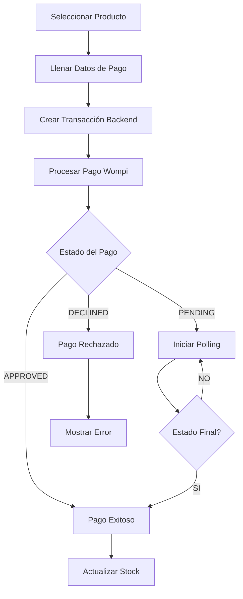

#  E-commerce Frontend - Integración Wompi

Sistema de e-commerce desarrollado en React con integración directa a Wompi para procesamiento de pagos desde el frontend.

##  Tabla de Contenidos

- [Características](#-características)
- [Tecnologías](#-tecnologías)
- [Instalación](#-instalación)
- [Configuración](#-configuración)
- [Arquitectura](#-arquitectura)
- [Servicios](#-servicios)
- [Componentes Principales](#-componentes-principales)
- [Flujo de Pago](#-flujo-de-pago)
- [Variables de Entorno](#-variables-de-entorno)
- [Uso](#-uso)
- [API Endpoints](#-api-endpoints)
- [Testing](#-testing)
- [Deployment](#-deployment)
- [Contribución](#-contribución)

##  Características

- 🛍️ **Catálogo de productos** 
- 💳 **Procesamiento de pagos 
- 🏢 **Gestión de departamentos y ciudades de Colombia** con APIs externas
- 📱 **Diseño responsive** para móvil y desktop
- 🔄 **Polling automático** para pagos pendientes
- 🧪 **Tarjetas de prueba** integradas para testing
- 🔒 **Validación completa** de formularios
- 📊 **Estados de pago en tiempo real**
- 🎯 **Experiencia de usuario optimizada**

## 🛠 Tecnologías

### Frontend
- **React** 18.x
- **Redux Toolkit** - Estado global
- **React Router** - Navegación
- **CSS3** - Estilos personalizados


### Ubicaciones
- **API Colombia** - Departamentos y ciudades


## 🚀 Instalación

### Prerrequisitos
- Node.js 16.x o superior
- npm o yarn
- Cuenta de Wompi (sandbox para desarrollo)

### Clonar el repositorio
```bash
git clone <repository-url>
cd ecommerce-frontend
```

### Instalar dependencias
```bash
npm install
```


## 🏗️ Arquitectura

```
src/
├── components/           # Componentes React
│   ├── CreditCardModal.js   # Modal de pago principal
│   ├── PaymentStep.js       # Paso de pago
│   ├── FinalStatus.js       # Estado final del pago
│   └── ...
├── services/            # Servicios y lógica de negocio
│   ├── wompiService.js     # Integración con Wompi
│   ├── paymentHandler.js   # Orquestador de pagos
│   ├── api.js              # Cliente HTTP para backend
│   └── colombiaLocations.js # Gestión de ubicaciones
├── store/               # Redux store
│   ├── index.js
│   └── slices/
└── styles/              # Archivos CSS
```

## 💳 Flujo de Pago



## 🔧 Variables de Entorno

| Variable | Descripción | Ejemplo |
|----------|-------------|---------|
| `REACT_APP_WOMPI_PUBLIC_KEY` | Llave pública de tercero para pagos | `pub_test_...` |
| `REACT_APP_WOMPI_PRIVATE_KEY` | Llave privada de tercero para pagos | `prv_test_...` |
| `REACT_APP_WOMPI_INTEGRITY_KEY` | Llave de integridad | `test_integrity_...` |
| `REACT_APP_API_BASE_URL` | URL del backend | `http://localhost:3001/api` |

##  Uso

### Desarrollo
```bash
npm start
```

### Construcción
```bash
npm run build
```

### Linting
```bash
npm run lint
```


## 🧪 Testing

### Tarjetas de prueba incluidas:
- **VISA Aprobada**: `4242424242424242`
- **VISA Rechazada**: `4000000000000002`
- **Mastercard Aprobada**: `5555555555554444`
- **Mastercard Rechazada**: `2223003122003222`

### Datos de prueba:
- **CVC**: `123`
- **Fecha**: `12/2025`
- **Titular**: `Test User`

## 🚢 Deployment


